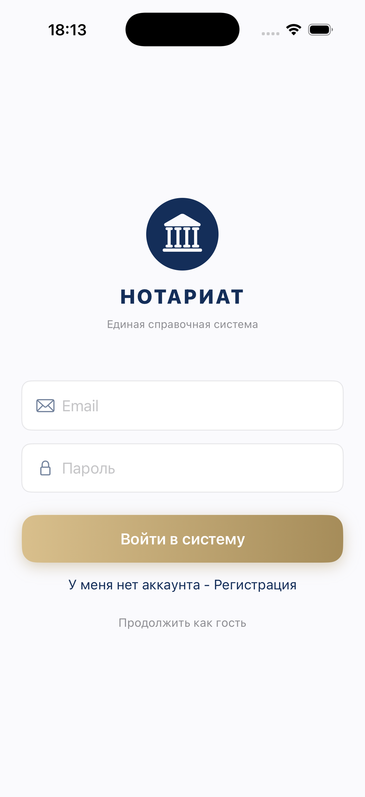

# NotaryApp

An iOS reference/directory app for notaries (coursework project — "Информационно-справочная система нотариата"). Lets users browse and search notaries, view them on a map, save favorites, and read informational articles, with separate dashboards for regular users, notaries, and admins.

## Role-based access

| Role | Capabilities |
|---|---|
| Guest | Browse the full notary registry, search/filter, view locations on the map |
| User | Authenticate, maintain a personal favorites list |
| Notary | Manage their own listing (contact info, schedule), handle appointment requests |
| Admin | Full CRUD on notary listings and articles (add/edit/delete) |

## Tech stack

- Swift, SwiftUI
- Core Data (local persistence, with a migration helper for schema changes)
- MapKit (notary locations)
- A custom `NetworkService` + `DataSyncManager` layer for syncing remote data into Core Data

## What I built

`DataSyncManager` fetches notary data over the network as DTOs, then merges it into Core Data on a background context — matching existing records by a string ID (`NSPredicate(format: "idString == %@", ...)`) rather than blindly re-inserting, so a sync updates existing local records instead of duplicating them. This is the standard "offline-first with background sync" pattern: the UI reads from Core Data (fast, works offline), and sync happens separately without blocking the main thread.

Three role-based dashboards (Admin/Notary/User) share the same underlying Core Data model but present different views and permissions — admins manage notary listings and articles, notaries see their own profile/dashboard, and regular users search and favorite notaries.

## Requirements

- Xcode 15+
- iOS 17+

## Setup / run

Open `NotaryApp.xcodeproj` in Xcode and run. Demo accounts are seeded on first launch via `Persistence.swift` (admin/user/notary roles), all with the placeholder password `123456` — this is intentional seed data for a coursework demo, not a leaked credential, but worth resetting to something else before treating this as anything beyond a course project.

## Note on this project

This is a university coursework project, not production software — good for demonstrating Core Data + sync architecture fundamentals, but frame it as coursework rather than a shipped product.

## Screenshots

